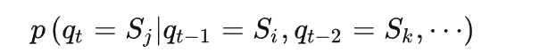

## 隐马尔可夫模型HMM

### 马尔可夫模型

- 某一个状态只由前一个状态决定，这就是一个一阶马尔可夫模型。而像天气这样，天气状态间的转移仅依赖于前 n 天天气的状态，即状态间的转移仅依赖于前 n 个状态的过程。这个过程就称为**n 阶马尔科夫模型**。

马尔可夫模型（Markovmodel）描述了一类重要的随机过程，随机过程又称随机函数，是随时间而随机变化的过程。

#### 定义

存在一类重要的随机过程：如果一个系统有 N 个状态$S_1,S_2,...,S_N$

随着时间的推移，从**某一状态**转移到**另一状态**

