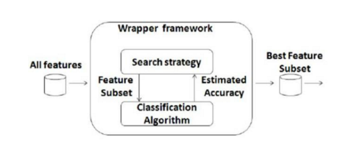
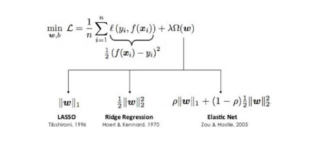
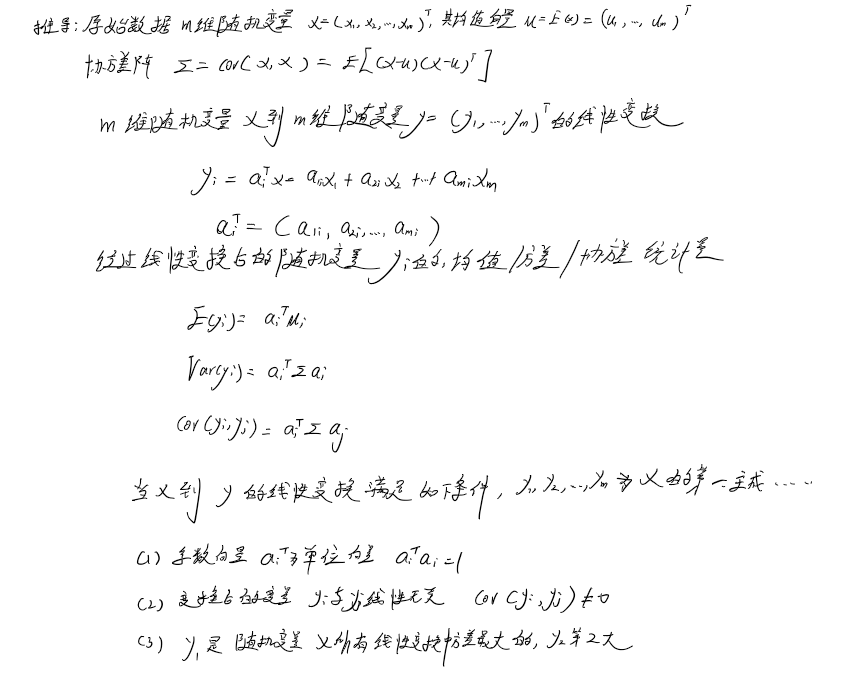
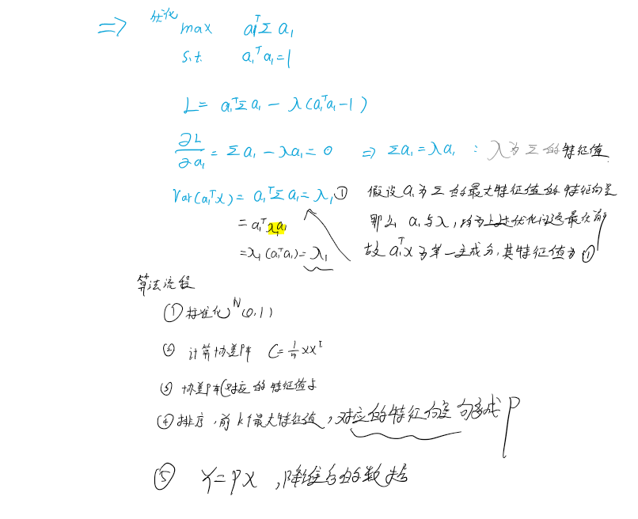
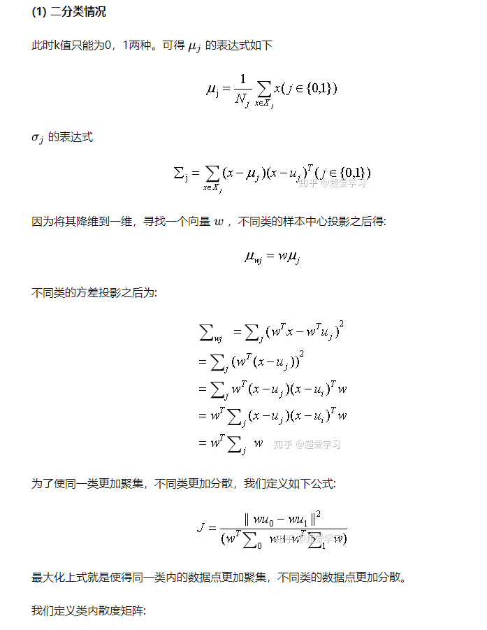
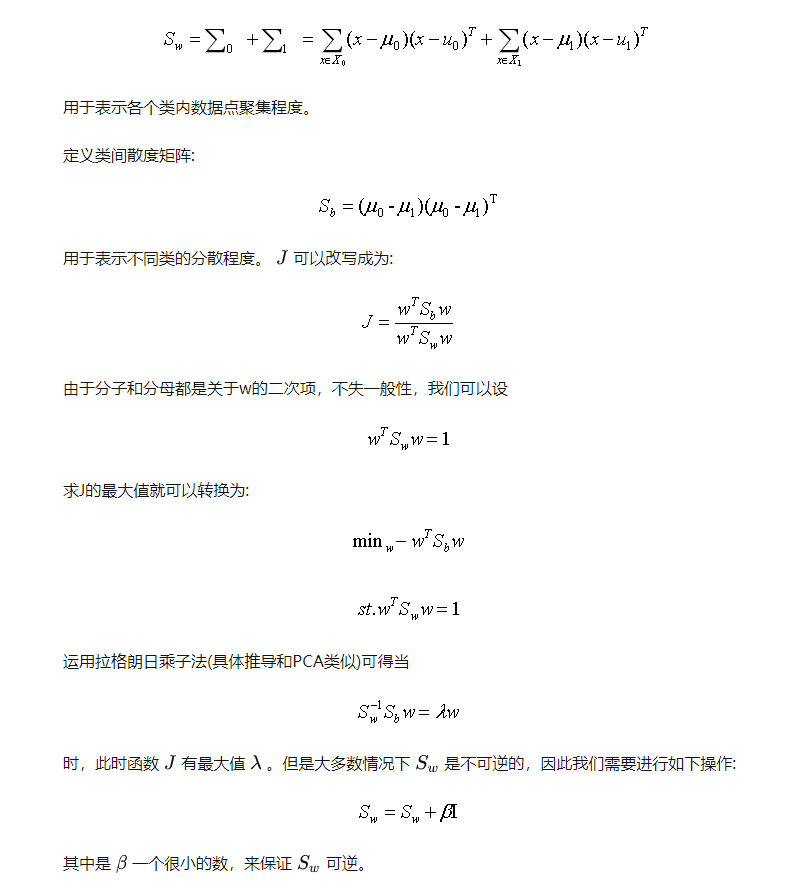
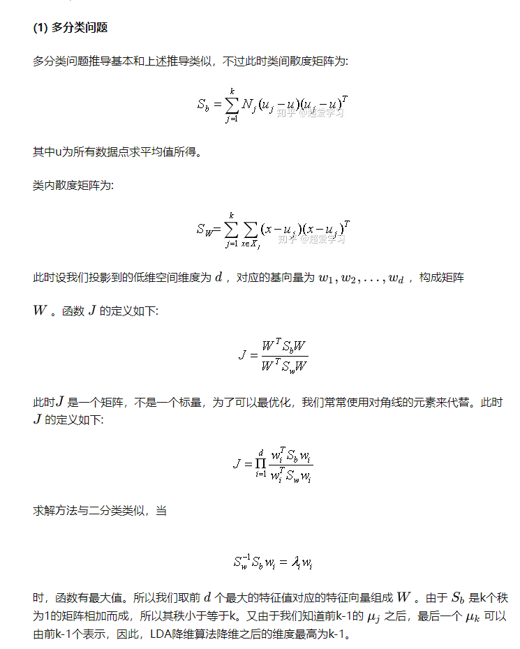
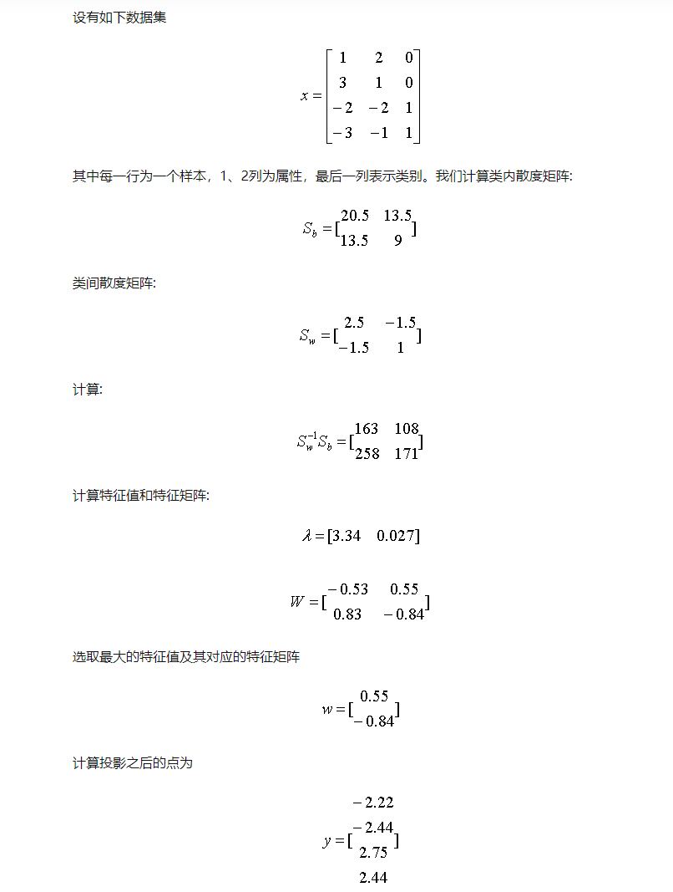
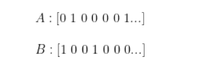
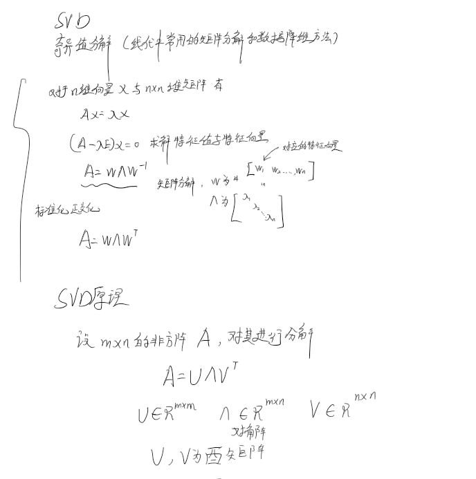

##   特征选择方法

### 过滤法 Fliter

#### 方差法

丢弃*小于*方差阈值的特征。高效过滤低方差特征，但不好设置阈值

#### 相关系数法Person相关系数

过滤相关性高的特征

协方差：衡量2个变量的相关程度。但容易受分布离散程度影响。两个**标准差小的变量相关性一般比两个标准差大的变量相关性程度高**。因此需要除以标准差。

####  互信息方法

person衡量线性相关，对于非线性很差。互信息计算两个变量间的熵的情况：**给定一个随机变量后，另一随机变量的不确性的削弱程度** 

- 信息量

  

- 信息熵

  

- 条件熵

  

- 互信息量

  

​	      

### 包裹法wrapper

选定特定的算法，再根据算法效果选择特征集合

不断通过启发式的方法来搜索特征：

- 选择一些特征，逐步增加以保证模型精度是否达标
- 删除一些特征，在慢慢保持算法精度的同时，缩减特征

### 嵌入法 --正则法Embedded

利用正则化思想，将部分特征属性的**权重调整到0**，则这相当于舍弃特征了。**L1 lasso**、**L2 Rige** .

**t通过在均方误差的基础上加入正则化矫正因子，通过不断求最小值的方法优化这个混合的损失函数，使得有些权重因子为0.**

### **基于树特征重要性的特征选择算法**

**属性重要性**是通过对数据集中的**每个属性进行计算**，并进行排序得到。在单个决策树中通过**每个属性分裂点改进性能度量的量来计算属性重要性**，由**节点负责加权和记录次数**。也就说**一个属性对分裂点改进性能度量越大（越靠近根节点），权值越大**；被越多提升树所选择，属性越重要。**性能度量可以是选择分裂节点的Gini纯度，也可以是其他度量函数**。

最终将一个属性在**所有提升树中的结果进行加权求和后然后平均，得到重要性得分**

## 特征降维方法

高维特征映射到低维空间中。

### PCA主成分分析

首先将数据**标准化**为均值为0.方差为1的数据，然后对标准化后的数据进行**正交变换**，将原来的数据转换为若干**线性无关**的新数据，且包含的信息量尽可能大（PCA仅用**方差**衡量变量的信息量大小）。

### LDA线性判别分析

LDA(线性判别算法)

不同于**PCA方差最大化理论**，LDA算法的思想是将**数据投影到低维空间之后，使得同一类数据尽可能的紧凑，不同类的数据尽可能分散**。因此，LDA算法是一种**有监督的机器学习算法**。同时，LDA有如下两个假设:

(1) 原始数据根据样本均值进行分类。

(2) 不同类的数据拥有相同的协方差矩阵。

当然，在实际情况中，不可能满足以上两个假设。但是当数据主要是由均值来区分的时候，LDA一般都可以取得很好的效果。

如图1所示，原始数据主要是根据均值来划分的，此时LDA降维效果很好，但是PCA效果就很差。

图2的两类数据主要区别是方差不同，因此此时PCA降维效果比较好，而LDA降维效果比较差。

### SVD奇异值分解

在机器学习领域，我们常常遇到的问题是，数据以 样本 * 特征 的形式存储为一个2维矩阵，而这其中，往往存在稀疏性，即样本量很大，特征维度也很多，但是对于不同的人而言，他们的特征表达可能都是非常稀疏的。

用特征向量的形式表示来说，可能样本A、B各自的特征向量如下：

0这种量化值，实际上并不包含信息

因此矩阵虽然很大，但是包含的信息量相比矩阵规模来说显得非常少，因此能不能通过提取重要信息的方式尝试对矩阵做一个降维呢。

为了讲述上面所说的矩阵降维，我们回顾一下特征值分解，在方阵的情况下，若可以分解，则有

其中由A的特征向量和特征值可以构成
$$
和p^{-1}
$$
那么搬到**长方阵**中，我们使用SVD，可以找到一组等式使得

$$
A_{M*N}=U_{M*N} \Sigma_{N*N} V_{N*M}
$$

这样还不够，因为我们发现这样做，得到的三个矩阵，累积的维度比原来的还大，这怎么降维呢？别急，我们回到特征值分解，在特征值分解中，需要求出原矩阵的特征值，但是实际上原矩阵的特征值有些可能非常小，这里就不得不提一下特征值与特征向量的含义：

**特征值：用于表示变化幅度**

**特征向量：用于表示变化方向**

这一点可以看公式，特征值特征向量的定义可以由下式表示：

$$
A\alpha_i =\lambda_i \alpha_i
$$
**特征值的大小表示了信息量**，因此我们可以**只提取原始矩阵中的部分信息即特征值较大的那些对应的信息**，假设我们只提取k个最大的特征值对应的信息，那么上述公式就变为：
$$
A_{M*N}=U_{M*K} \Sigma_{K*K} V_{K*M}
$$
一般来说信**息会集中在前面比较大的特征值上**，而在SVD中，**奇异值的大小降低得非常快，因此我们可以就取部分的奇异值及其对应的奇异向量来近似替代原矩阵做一个降维**，这就是整个SVD做降维的思路。

### T-SNE 可视化效果最好的降维算法

